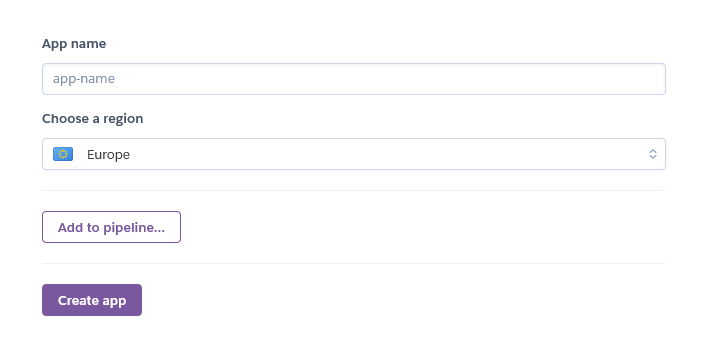
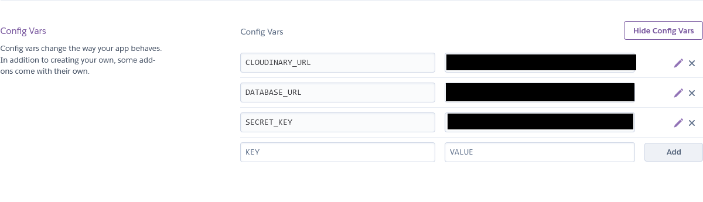

# Restaruant Management App
    - The purpose of this document is to give a detailed description of the requirements for the Restaurantly web site. It will illustrate the purpose, scope and complete description for the development of system. It will also explain external interface requirements and system

### Reserve table, check fresh menu, read about restaurantly blogs and more.
      

### Link to the finished site: [LINK](https://resturantly-63531e9faaad.herokuapp.com/)
_____________________________________________________________________________
## Am I responsive image 

_____________________________________________________________________________
## Content:
- ### Project Goals and target audience
    - [Achieved](#achieved)
    - [Future implements](#future-projects)
    - [Audience](#audience)
- ### Project management
    - [Project boards](#github-project-board-user-stories-issues)
    - [Site user goal](#site-user-goal)
    - [Site owner goal](#site-owner-goal)
    - [User Stories](#user-stories)
- ### Wireframes and templates
    - [Lucid Chart](#lucid-chart)
    - [DrawSql Chart](#drawsql-chart)
    - [Database Structure](#database-and-structure)
    - [Balsamiq Template](#balsamiq-templates)
- ### Design and Features
    - [Design and Features](#design-and-features-1)
        - [Navbar](#navbar)
        - [Register](#register)
        - [Login](#login)
        - [Home Page](#landing-page)
        - [Meals](#create-a-post)
        - [About Us](#posts-view-all-posts)
        - [Our Blog](#post-details--see-details-about-a-post)
        - [Reserve a table](#like-a-post)
        - [Booking list](#comments-on-posts)
        - [Contact](#update-your-profile-image)
        - [Footer](#footer)

    - [Colour Scheme](#colour-scheme)
    - [Typography](#typography)
    - [Imagery](#imagery)
- ### Technologies Used
    - [Languages used](#languages)
    - [Frameworks, Packages & Programs Used](#frameworks-packages--programs-used)
- ### Testing
    - [TESTING.md](#testingmd)
- ### Issues/Errors and resolution
- ### Development and Deployment
    - [Development](#development)
    - [Deploy to Heroku](#deployment)
- ### Credits
    - [Code](#code)
    - [Youtube tutorials](#youtube-tutorials-i-have-watched)
    - [Acknowledgements](#acknowledgements)

_____________________________________________________________________________
## Project goals and target audience.  
### Achieved:

-   A web application that aims to digitalize the process of various restaurant

management operations including ordering and inventory management and POS. This document

aims to capture the system requirements and features particularly related to ordering and

inventory management to be implemented in DineOut version 1.0., with the later releases on

POS (Point of Sale).

- Restauranly is a restaurant management system developed with the intention of automating the day

to day tasks in a restaurant like order and inventory management, bill generation and taking

feedback. This release of the software would deal with these tasks only whereas more areas

might be automated in the future versions of this software. The main purpose is to improve the

performance of the restaurant by eradicating the daily paperwork. With this system the tasks

would be performed in less amount of time and more efficiently. An additional benefit of this

software is that during the rush hours the load can be balanced effectively, and restaurants would

perform better than usual

### Future projects: 

- Generate bills
- Auto suggestion for meals , based on user search history.

## Audience:

Restaurantly app will attempt to replace the traditional manual ordering process and is a new self-

contained software system that consists of two parts: one mobile application and the other is

Firebase database. The mobile application will be used for ordering and interacting with the

inventory while the Firebase database will be used for storing the inventory and ordering related

information about the food items like pending and complete order queues.

The mobile application will have five interfaces. Each for Customer, Manager, Head Chef,

Admin and Chef. Manager can see/edit the status of available/reserved tables. Customer’s

interface will consist of a scrollable menu listing available items and their price. When the

customer selects some dishes and place the order, it will be stored in “pending orders” table in

Firebase database. Head Chef’s interface will be such that he is notified of the pending order and

he is able to assign it to one the available queues of chefs who are then able to see the new order

in their screens or on a central display in kitchen. After each item/dish in an order is prepared,

the order is marked completed through the Head Chef’s interface, the hall manager gets notified

through his interface. Customer’s interface has an option for requesting the bill. Bill is printed

through the Manager’s interface. Admin can change and modify the Firebase database like add

new menus or staff, edit current inventory stock etc.

## Why would they visit the website in the first place

- They have an interest in online food.
- Looking for better place to have gathering with family.
- Learn more about restaurantly.
- Getting inspired by other good services restaurant.
- Connect with others in the community.
- Recruit people to a group buy.

## Why would they return to the website

• Allow Customers to scroll through the menu and select the dishes he/she wants.
• Allow the Customers to cancel/edit the order any time before its prepared.

• Allow Customers to provide feedback regarding the food and overall service of the

restaurant.

• Allow Customers to request for bill.

• Allow Customers to ask for help through the system.

• Assign Head Chef to assign the dishes in an order to chefs according to their specialties.

• Show dish queues and their status, for Chefs.

• Allow admin to perform CRUD (create, retrieve, update and delete) operations on Staff

Members, Menu Items and Inventory.

• Allow Head Chef to mark orders complete.

• Allow the Head Chef to approve cancellation of dish or order.

• Allow Hall Manager to mark the bill as paid.

• Notify the Hall Manager when a particular order is complete.

• Allow the Hall Manager to see/edit status of tables reserved and available and their

capacities.

[Back to top](#show-your-keyboard)

_____________________________________________________________________________ 
## Project management

### Github project board, user stories, issues.

- Show your keyboard was developed using an agile method. That includes using GitHub issues, user stories and kanban boards.
That gave me an overview of tasks structured in a to-do, in-progress and done way.
Project board with user stories [Link](https://github.com/rajahaseebfayyaz/restaurantWebApp)     

_____________________________________________________________________________  
## Site user goal
There are four types of users that interact with our system (See appendix B). Firstly, there is a

Hall Manager, then Customer, Head Chef and Admin. We’ll provide an interface for Chefs as

well through which they are looking at the status of their order queues, but they will not interact

with our system.

## Customer class

Customers interact with our system directly in order to place order, modify order, get bill and

give feedback. We do not store any information related to customers in our system. The process

of order taking starts from customers placing order and then the other series of events begin.

## Site owner goal
Head Chef can mark a dish as prepared when a chef tells him to do so. He can approve the

cancellation of an order whenever a customer edits or removes a dish from his order. He can also

assign a dish to a particular chef based on the specialty of the chef.

[Back to top](#show-your-keyboard)
_____________________________________________________________________________  
## User Stories
- As a Site User, I want the navigation to be user-friendly so I can easily navigate the app content.
- As a Site User, I want to know info on what the app is about so that I can use its functionality for mutual benefit
- As a Site User, I can be able to register, login and logout from the website so that I can have a safe environment to work with
- As a Site User, I can visit the posting page and view all the posts that have been made to the website
- As a Site User, I can click on a post and get a detailed view of that particular post
- As a Site User, I can, if I'm logged in, click on a post and add comments and like that post
- As a Site User, I can easily see on the landing page the newest post and comments that have been made
- As a Site User, I can, if I'm logged in, go to my profile page and then change my profile image
- As a Site User, I can, if I'm registered, create my post
- As a Site User, I can, if I'm logged in, edit and delete my created posts if I want to
- As a Site User, I can easily see the links in the footer and contact the creator of the website
- As a Site User, I can see the correct error message when i do something wrong or go to a forbidden link    

## Site Owner Stories
- As a Site Owner, I want to restrict access to sections of an app to unauthenticated users so that basic standards of data protection are met
- As a Site Owner, I would like that authenticated users to have full access to the web app and its functionality

_____________________________________________________________________________ 

## Lucid chart

## DrawSql chart

## Database and structure
   

## Balsamiq templates   

### Landing page (index.html)

_____________________________________________________________________________ 
## Design and Features:   

## Reserve a table
_____________________________________________________________________________ 
### A form for creating a new post with the possibility to upload an image.   
    

## Booking list (View booking list)
_____________________________________________________________________________ 
### See all bookings on the website.   
     

## Blogs details ( See details about a post)
_____________________________________________________________________________ 
### Shows details about bligs, gives you the choice to like and comment on the post.   
    

## ABout-us
_____________________________________________________________________________ 
    

[Back to top](#show-your-keyboard)

_____________________________________________________________________________  
## Languages

- HTML5 from CodeInstitute Template(some own modifications to style the website)
- CSS
- JavaScript from Bootstrap 5
- Python / Django code, all done by myself.   

[Back to top](#show-your-keyboard)
____________________________________________________________________________  
## Frameworks, Packages & Programs Used

- Lucidchart for overwiev of code.
- Google Sheets to make a bug testing sheet.
- DrawSql for the database
- Django packages used:
    - render, reverse_lazy, reverse, redirect, messages, HttpResponseDirect, get_object_or_404
    - ListView, DeleteView, DetalView, CreateView, UpdateView, LoginRequiredMixin
    - Sum, Count, Q

[Back to top](#show-your-keyboard)
____________________________________________________________________________  
## Development

- All code was done in Github
- Comitted and pushed to my GitHub repository and 
[ElephantSQL](https://www.elephantsql.com/) used for Postgres server.   

## How to start a Django project
- Created a new repository on GitHub "Show your Keyboard"
- Opened the workspace on Gitpod
- In the terminal run the command "pip3 install django"
- Install your supporting libraries with
    - pip3 install dj_database_url==0.5.0 psycopg2 (PostgresSQL)
    - pip3 install dj3-cloudinary-storage (Cloudinary Libraries)
    - pip3 install urllib3==1.26.15 (Cloudinary Libraries)
- Create a requirements.txt to later on tell heroku what libraries it need to install
    - pip3 freeze --local > requirements.txt
- Create your project with the following command
    - django-admin startproject ShowYourKeyboard . (Don't forget to add the dot at the end)
- Create your app 
    - python3 manage.py startapp home (created the "home" app)
- Add the apps to "INSTALLED APPS" in your settings.py file
- Migrate your changes to the database with python3 manage.py migrate
- Create an account on ElephantSQL
- Create an account on Heroku, create a new "app," and add your DATABASE_URL to config vars in settings
- !IMPORTANT create an env.py file in the top root directory
    - In your env.py, at the top, "import os"
    - Set environment variables: os.environ["DATABASE_URL"] = "Paste in ElephantSQL database URL"
    - Add a secret key: os.environ["SECRET_KEY"] = "Make up your own randomSecretKey"
    - Add the secret key to your config vars on Heroku
    - Go to your settings.py and add the following code:
        ("This will hide all your secret information on the website from being deployed to GitHub")
        from pathlib import Path     
        import os      
        import dj_database_url    
        if os.path.isfile("env.py"):    
        import env   
    - Remove the insecure key from settings.py SECRET_KEY = os.environ.get('SECRET_KEY')
- Comment out the Database section in settings.py and add:
    - DATABASES = {     
        'default': dj_database_url.parse(os.environ.get("DATABASE_URL"))    
        }   
- Go back to Heroku and add your Cloudinary url to config vars:
    - CLOUDINARY_URL, cloudinary://**********
- In your settings.py, add Cloudinary to your INSTALLED APPS in this order:
    - 'cloudinary_storage',
    - 'django.contrib.staticfiles',
    - 'Cloudinary',
- Now you need to tell Django to use Cloudinary to store media and static files:
    - STATIC_URL = '/static/'

    - STATICFILES_STORAGE = 'cloudinary_storage.storage.StaticHashedCloudinaryStorage'
    - STATICFILES_DIRS = [os.path.join(BASE_DIR, 'static'), ]
    - STATIC_ROOT = os.path.join(BASE_DIR, 'staticfiles')

    - MEDIA_URL = '/media/'
    - DEFAULT_FILE_STORAGE = 'cloudinary_storage.storage.MediaCloudinaryStorage'
- Link the templates dir:
    - TEMPLATES_DIR = os.path.join(BASE_DIR, 'templates')
    - Change templates dir to TEMPLATES_DIR
        TEMPLATES =      
        …,    
        'DIRS': [TEMPLATES_DIR],   
- Create the following folder in top root directory:
    - media
    - static
    - templates
    - Procfile (!IMPORTANT to use capital P)
- Now add . commit and push the project to GitHub.
- Go to Heroku and follow the Deployment guide below.  

## Issues/Error and resolution

| Error | Description | Resolution|
|:----:|:----:|:----:|
| TypeError at reserve_table | n the view function above you passed the argument as list_id but in your url pattern you passed it in as id...this is what is leading to the conflict...resolve this and it should work just fine| whatever argument you pass to you view function should be the same argument you pass to that's view corresponding url pattern|
| Django Database Error | relation "post" does not existLINE 1: SELECT COUNT(*) FROM "post"| eed to drop your tables and then do syncdb so the new schema is correctly applied.|
| django/postgres error:'database restaurantly does not exist' | django.db.utils.OperationalError: FATAL:  database "restaurantly" does not exist| python manage.py makemigrations could find it using the settings in DATABASES.|
| Django project Page not Found  | getting a 404 on the http://localhost:8000/contactus/ page| 'contactus.urls' means contactus/urls.py, i.e. need to have a urls.py in the contactus app folder. The URL dispatcher then will concatenate the path in your main urls.py ('polls/') and the one in the polls/urls.py ('') to resolve the view name (views.index).|
| Register feature was not showing the error when it happened | | Debug Register function and remove else statement to redirect the user to the same page when it happens. After deleting this part of the function, everything worked fine. 

## Testing and Code validation 

All testing and code validation details are described in a separate file called TESTING.md and can be found [here](TESTING.md).

## Deployment

## Deployment 

This App is deployed using Heroku.

- Before deployment hide the confidential data in env.py
- Set debug to False in settings.py (if project is going live)
- Login to [Heroku](https://www.heroku.com) (Create an account if necessary)
- In the settings tab for the new application, created one Config name PORT and has a value of 8000
- Connect your Heroku with your GitHub account and the repository you are working on
- Then at the bottom, you can do a manual deployment or set it to automatic deployment to deploy every time your repo is updated.   

[Back to top](#show-your-keyboard)

Heroku Deployment steps 

 
 1. Ensure all dependencies are listed on requirements.txt. 
 
 Write on python terminal ` pip3 freeze > requirements.txt`, and a list with all requirements will be created to be read by Heroku. 
 
 2. Setting up your Heroku

    2.1 Go to Heroku website (https://www.heroku.com/). 
    2.2 Login to Heroku and go to Create App.
    
    
    
    
    
    2.3 Click in New and Create a new app
    
    
    
    2.4 Choose a name and set your location
    
    

    2.5. Navigate to the Resources tab 

    

    2.6. Click on Resources and Seach for Heroku Postgres and select it on the list.
    
    
    
    2.7. Navigate to the deploy tab
    
    
    
    2.8. Click in Connect to Github and search for 'nandabritto' GitHub account and 'search_your_brand' repository
    
    
    
    2.9.  Navigate to the settings tab
    
    
    
    2.10.  Click on Config Vars, and add your Cloudinary, Database URL (from Heroku-Postgres) and Secret key.    
    
    
 

3. Deployment on Heroku

    3.1.  Navigate to the Deploy tab.
    
    
    
    3.2.  Choose the main branch to deploy and enable automatic deployment to build Heroku every time any changes are pushed on the repository.
    
    
    
    3.3 Click on manual deploy to build the App.  When complete, click on View to redirect to the live site. 
    
    

Forking the GitHub Repository 

* By forking the GitHub Repository, you will be able to make a copy of the original repository on your own GitHub account, allowing you to view and/or make changes without affecting the original repository by using the following steps:

    Log in to GitHub and locate the GitHub Repository
    At the top of the Repository (not top of page), just above the "Settings" button on the menu, locate the "Fork" button.
    You should now have a copy of the original repository in your GitHub account.

* Making a Local Clone

    Log in to GitHub and locate the GitHub Repository
    Under the repository name, click "Clone or download".
    To clone the repository using HTTPS, under "Clone with HTTPS", copy the link.
    Open Git Bash
    Change the current working directory to the location where you want the cloned directory to be made.
    Type git clone, and then paste the URL you copied in Step 3.

$ git clone https://github.com/rajahaseebfayyaz/resturantProd

Press Enter. Your local clone will be created.

_____________________________________________________________________________  

## Credits.  

### Code

Inspired by CI's blog tutorial "I think, therefor i blog"

Docs for using Django-Resized 
[Link](https://pypi.org/project/django-resized/)

Good read about class based views in django   
[GeekforGeeks](https://www.geeksforgeeks.org/listview-class-based-views-django/)    
[DjangoDocs](https://docs.djangoproject.com/en/4.2/ref/class-based-views/generic-display/#detailview)

How to use slice
[Link](https://docs.djangoproject.com/en/4.2/ref/templates/builtins/)

A post about styling bootstrap and register forms in django
[Link](https://stackoverflow.com/questions/63534184/django-password-field-not-rendering-with-bootstrap-attributes)

How to add a form when using DetailView
[Link](https://stackoverflow.com/questions/44985709/displaying-other-form-inside-detailview-in-django)

DjangoDocs about redirect and request.path
[Link](https://docs.djangoproject.com/en/2.2/ref/request-response/#django.http.HttpRequest.path_info)

Tutorial on how to implement a search function
[Link](https://learndjango.com/tutorials/django-search-tutorial)

This is the bootstrap footer template i used for the website
[Link](https://mdbootstrap.com/docs/standard/navigation/footer/)

Static text on a carousel
[Link](http://www.prepbootstrap.com/bootstrap-template/carousel-static-headline)    

Several links to different posts on stackoverflow regarding DetailView
and edit, delete.   
[Link](https://stackoverflow.com/questions/46791757/having-an-edit-form-and-a-detail-view-on-the-same-page)
[Link](https://stackoverflow.com/questions/70815356/update-data-inside-class-based-detail-view)
[Link](https://stackoverflow.com/questions/61803490/django-modify-a-generic-detail-view-to-manage-a-form-and-post-data-django)    

This is my post on Stackoverflow that after 3 days finally solved my problem rendering messages (THANK YOU NIKO)
[Link](https://stackoverflow.com/questions/76491626/django-messages-wont-show-up-in-template?noredirect=1#comment134876317_76491626)

Website to help you make gradient background colors.    
[Link](https://cssgradient.io/)

_____________________________________________________________________________   

## Youtube tutorials i have watched:    

Helpful tutorial by CI's own Dee MC.
[Link](https://www.youtube.com/watch?v=sBjbty691eI&ab_channel=DeeMc)

Programming with Mosh.
[Link](https://www.youtube.com/watch?v=rHux0gMZ3Eg)    

Python Django 7 hours course
[Link](https://www.youtube.com/watch?v=PtQiiknWUcI&t=6190s)   

Bobs Programmning Academy
[Link](https://www.youtube.com/watch?v=EUMpUUXKvP0&t=101s)   

Telusko Django tutorial
[Link](https://www.youtube.com/watch?v=OTmQOjsl0eg&t=1880s)

_____________________________________________________________________________   

### Acknowledgements
- Tristan for letting me use his fantastic images.   

- My Mentor for continuous helpful feedback.

- Tutor support at Code Institute for their support.    

- My family for letting me pursue my career change.   
[Back to top](#show-your-keyboard)